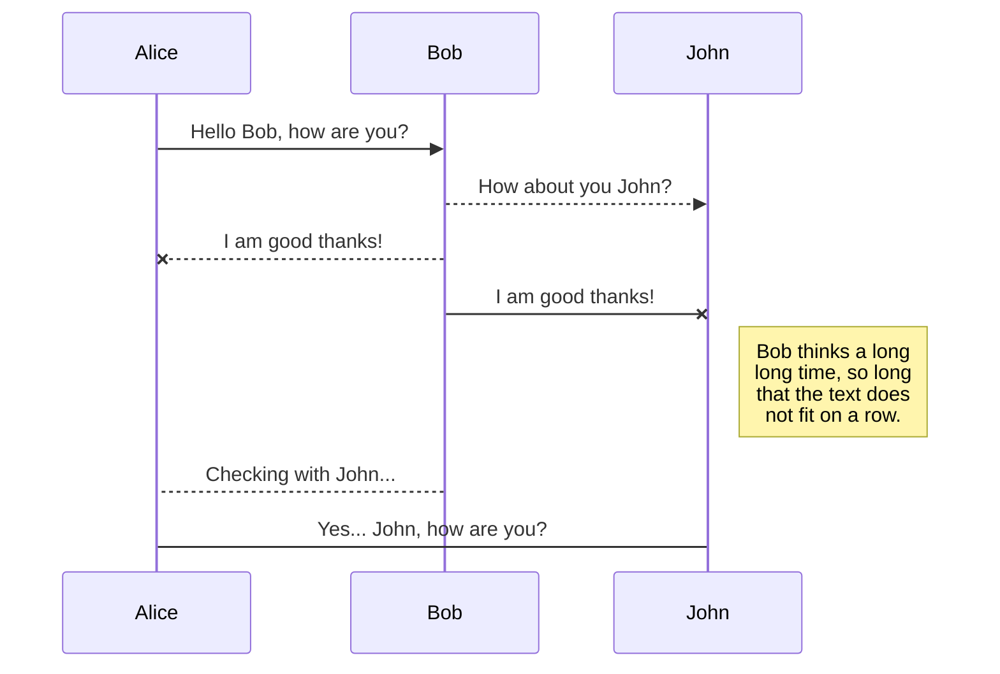
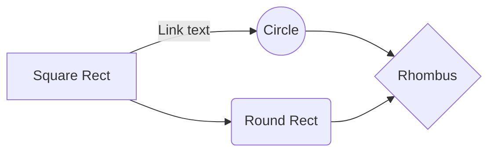

# Tech Architecture

## Common
This is strictly for types that are used by both frontend and backend. Don't put anything else here. 

## Backend

We use _trpc_ to communicate with the backend privately, but we also use _Fastify_ which provides public REST APIs. The REST APIs require an API key. The TRPC access is either public or requires the auth key. We also use kysely as a QueryBuilder to communicate with the database.

The backend uses a directory structure that clarifies what the files in the directory do:

- db.operators - all database operators
- fastify.controllers - All fastify controllers. There's a 1:1 mapping between fastify routes and controllers
- fastify.plugins - all fastify plugins. Every plugin is loaded automatically
- fastify.routes - Each route has a controller
- fastify.schema - used by the route for type checking
- trpc.handler - helper classes used by trpc routers
- trpc.routers - Similar to fastify.routes, these define trpc routes

Other main files:

- fastify.routes - This collects and exports all fastify routes
- trpc.routers - This collects and exports all trpc routers
- context.ts - Creates the context that's used by trpc routers

## Frontend

The frontend is Angular with tailwind.css. We prefer using _signals_ over rxjs.

**Guards**: The frontend has two guards: auth and login. The auth guard takes us to the login page if the user doesn't have an auth token. The login guard takes us to the console if the user is already logged in.

**UXCommon**:

- Alerts: The alerts component we use instead of toastr.
- Breadcrumb
- Datagrid - creates a general ag-grid datagrid that allows a lot of code sharing
- icons - A wrapper around svg icons. We use them from hero-icon and use the same names. It allows us to use the icons dynamically
- not-found: a simple 404 page
- swap: See the light/dark icon swap to see how this works
- Tags: these are chips / tags

## SmartyPants

SmartyPants converts ASCII punctuation characters into "smart" typographic punctuation HTML entities. For example:

|                  | ASCII                           | HTML                          |
| ---------------- | ------------------------------- | ----------------------------- |
| Single backticks | `'Isn't this fun?'`             | 'Isn't this fun?'             |
| Quotes           | `"Isn't this fun?"`             | "Isn't this fun?"             |
| Dashes           | `-- is en-dash, --- is em-dash` | -- is en-dash, --- is em-dash |

## KaTeX

You can render LaTeX mathematical expressions using [KaTeX](https://khan.github.io/KaTeX/):

The _Gamma function_ satisfying $\Gamma(n) = (n-1)!\quad\forall n\in\mathbb N$ is via the Euler integral

$$
\Gamma(z) = \int_0^\infty t^{z-1}e^{-t}dt\,.
$$

> You can find more information about **LaTeX** mathematical expressions [here](http://meta.math.stackexchange.com/questions/5020/mathjax-basic-tutorial-and-quick-reference).

## UML diagrams

You can render UML diagrams using [Mermaid](https://mermaidjs.github.io/). For example, this will produce a sequence diagram:

And this will produce a flow chart:

